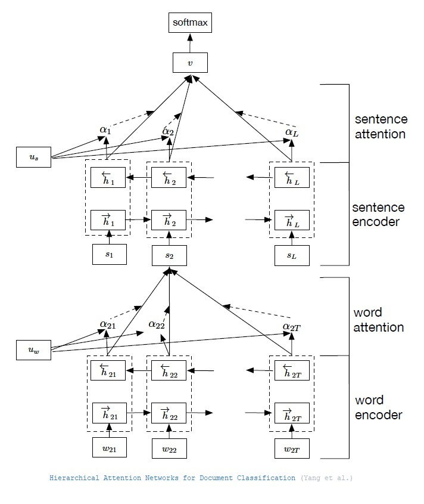
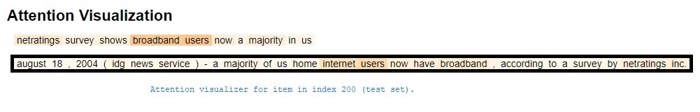

# Hierarchical Attention Network
Hierarchical-Attention-Network for Document Classification implementation in PyTorch.
This repository is an implementation of the article [Hierarchical Attention Networks for Document Classification
](https://www.aclweb.org/anthology/N16-1174/) (Yang et al.).



## Setup Instructions
Install `pipenv` with the following command:

```
$ pip install pipenv
```

Open pipenv environment in a new shell:

```
$ pipenv shell
```

Add the project to PYTHONPATH:

```
$ export PYTHONPATH=$PYTHONPATH:/path/to/han/src
```

Install dependencies:

```
$ pipenv sync
```

## Usage

### Step 1: Download data sets

Download the document classification data sets from my Google Drive [folder](https://drive.google.com/drive/folders/0Bz8a_Dbh9Qhbfll6bVpmNUtUcFdjYmF2SEpmZUZUcVNiMUw1TWN6RDV3a0JHT3kxLVhVR2M?usp=sharing). Unpack it somewhere to create the following directory structure:
```
/path/to/data
├── ag_news_csv
│   ├── classes.txt
│   ├── readme.txt
│   ├── test.csv
│   ├── train.csv
├── yahoo_answers_csv
│   ├── classes.txt
│   ├── readme.txt
│   ├── test.csv
│   ├── train.csv
...
```

### Step 2: Run the experiments

Every experiment has its own config file in `experiments`.
The pipeline of working with any model version or dataset is: 

``` bash
python run.py preprocess experiment_config_file   # Step 3a: preprocess the data
python run.py train experiment_config_file        # Step 3b: train a model
python run.py infer experiment_config_file        # Step 3c: evaluate the results
```

Use the following experiment config files to reproduce results:

* AG News, GloVE version: `experiments/han-yahoo-glove-run.jsonnet.jsonnet`
* Yahoo Answers, GloVE version: `experiments/han-yahoo-glove-run.jsonnet`

One may add new configuration files from other data sets or even play with the hyper-parameters of the existing configuration.

The `infer` step will output the classification report against the test set of the desired data set. For example, on the `AG News` data set:

```
               precision    recall  f1-score   support

       World       0.94      0.93      0.93      1900
      Sports       0.98      0.99      0.98      1900
    Business       0.89      0.91      0.90      1899
    Sci/Tech       0.92      0.90      0.91      1900

    accuracy                           0.93      7599
   macro avg       0.93      0.93      0.93      7599
weighted avg       0.93      0.93      0.93      7599
```

### Step 3: Visualize Predictions

One can visualize the sentence/word attention weights per each item in the test set, after running the `infer` command,
using the notebook `notebooks/Prediction Visualizer.ipynb`.

Please note that one may need to change the value of `PREDICTIONS_PATH` when using this notebook.

For example, for item in index 200, we will notice that the 2nd sentence (out of 2) got the most attention and same goes for
the phrases: **broadband  users** and **internet  users** that had the highest weights when determining the prediction of
class `Sci/Tech`:




## References

[1] Zichao Yang, Diyi Yang, Chris Dyer, Xiaodong He, Alex Smola, Eduard Hovy, [Hierarchical Attention Networks for Document Classification
](https://www.aclweb.org/anthology/N16-1174/)

```
@inproceedings{yang-etal-2016-hierarchical,
    title = "Hierarchical Attention Networks for Document Classification",
    author = "Yang, Zichao  and
      Yang, Diyi  and
      Dyer, Chris  and
      He, Xiaodong  and
      Smola, Alex  and
      Hovy, Eduard",
    booktitle = "Proceedings of the 2016 Conference of the North {A}merican Chapter of the Association for Computational Linguistics: Human Language Technologies",
    month = jun,
    year = "2016",
    address = "San Diego, California",
    publisher = "Association for Computational Linguistics",
    url = "https://www.aclweb.org/anthology/N16-1174",
    doi = "10.18653/v1/N16-1174",
    pages = "1480--1489",
}
```